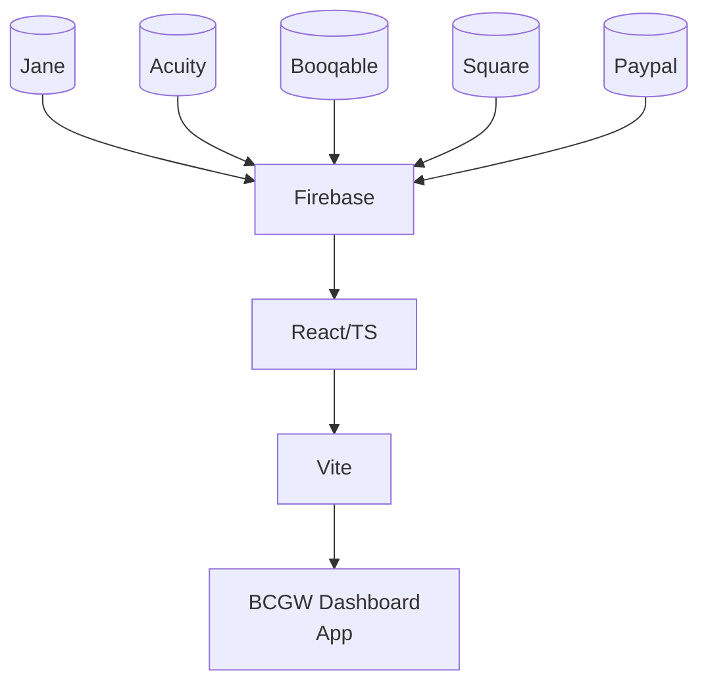

# Breastfeeding Center for Greater Washington


##  Table of Contents

1. [Project Info](#project-info) 
2. [Tech Stack](#tech-stack)
3. [Running Project Locally](#running-project-locally)
4. [Points of Contact](#points-of-contact)
___


# Project Info

Welcome to the Breastfeeding Center of Greater Washington/Hack4Impact-UMD repository! BCGW provides pregnancy and postpartum care to individuals and families in the greater Washington DC area.

This project aims to centralize data and analytics for the organization in order to streamline operations and aid in grant application processes.

# Hosting
We are currently using Firebase Hosting. You can view a dev deployment of the application at https://breastfeeding-center-gw.web.app/

# Tech Stack
**Frontend:**

- Framework: [React](https://react.dev/)
- Language: [Typescript](https://www.typescriptlang.org/docs/handbook/intro.html)
- Styling: [Tailwind](https://tailwindcss.com/)
- Libraries: [Reaviz](reaviz.dev), [ShadCN](https://ui.shadcn.com/)
- Build Tool: [Vite](https://vitejs.dev/)

**Backend:**
Authentication, Database, and Hosting: [Firebase](https://firebase.google.com/)

**APIs:**
- [Mailchimp](https://mailchimp.com/developer/marketing/docs/fundamentals/)
- [Acuity](https://developers.acuityscheduling.com/)
- [Booqable](https://developers.booqable.com/)
- [Square](https://developer.squareup.com/reference/square) (potentially less important?)
- [Paypal](https://developer.paypal.com/api/rest/)
- [Jane](https://jane.app/) (imported via Excel sheet converted to JSON)




# Running Project Locally

1. Clone the repo and ```cd``` into it
2. run ```npm install``` in the ```react-app``` directory
3. run ```npm run dev``` in the ```react-app``` directory
4. Navigate to http://localhost:5173 in your browser (typically pops up automatically)

# Points of Contact

For inquiries about the project, contact

| Name          | Contact                   |
| ------------- | ------------------------- |
| Sophie Tsai   | sophietsai31@gmail.com    |
| Ramy Kaddouri | rkaddour@terpmail.umd.edu |
| Prakhar Gupta | pg12@terpmail.umd.edu     |
